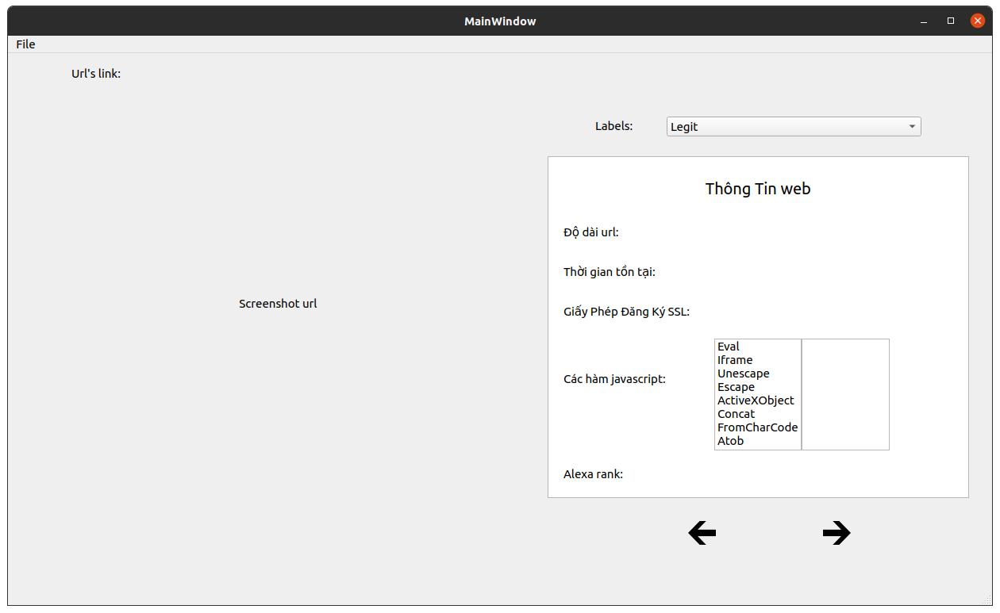
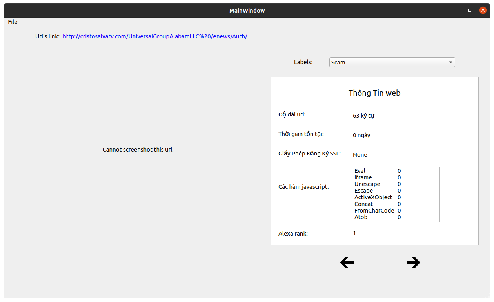

# URL-Labeling-app

- Create python virtual env first

```
python3 -m pip install -r requirements.txt
docker-compose up -d
python3 index.py
```
- When run the program, it will appear like this


- Clike op file on top of the program to select data file

- When finished, the window looks like below. Based on the feature points appear, you choose the appropriate label for each url


- When you click next or previous arrow, the data will be saved automatically
- the program is abit slow so don't rush


